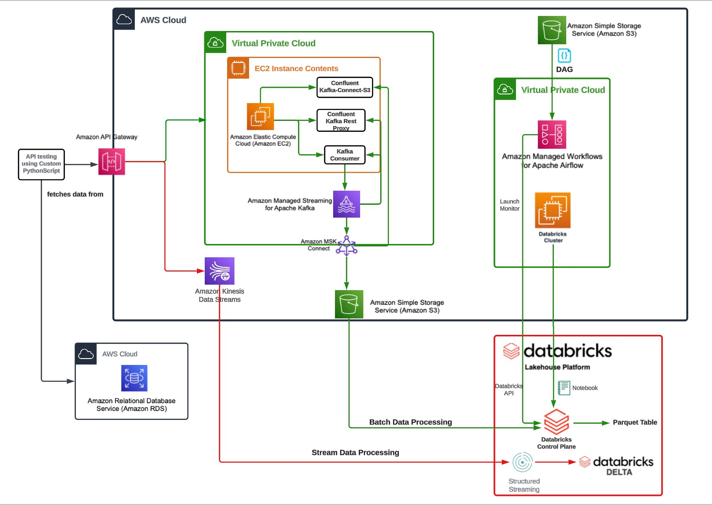

# Pintrest Data Pipeline

## Scenario:

Pinterest crunches billions of data points every day to decide how to provide more value to their users. This is an attempt to demonstrate how to create a (simplified) similar system using Amazon Web Services.

## Scenario Architecture



This code base is concerned with creating inputs and processing outputs for Pintrest-style data. 

## Scenario Demonstrations

There's two main demonstrations:

* Batch Processing - where sample Pinterest data is sent via a configured Amazon API Gateway to a Kafka producer, is written to an S3 bucket, which is then consumed by Databricks, and finally cleansed and processed for valuable insights. The batch processing schedule is handled by Amazon Managed Workflows for Apache Airflow.
* Streaming data processing - where sample Pinterest data is sent to an Amazon Kinesis Data Stream which is then consumed by Databricks and finally cleansed and written to a Databricks Delta table

(Please note that creating, and configuring a Kafka/MSK instance is *out of scope* for this project)

 At the end of this readme, there will be an explanation of how some of the AWS services
 were configured.


# File Structure

For the batch processing demonstration:

* `user_posting_emulation.py` -  This script pulls sample Pinterest data, from a database, and then sends the data to a configured Amazon API gateway.  The gate endpoints have been configured so that the data is sent to a Kafka producer. This file can be run locally.

* `databricks_s3_to_databricks.ipynb` -  This notebook is run on the Databricks platform and is scheduled to run using Amazon managed workflows for Apache Airflow.  Pinterest data is pulled from an Amazon S3 bucket, the data is cleansed and then finally the data is processed for insights.  Each step is commented in the file itself.

* `124a514b9149_dag.py` - This is a DAG ("Directed Acyclic Graph").  This is a definition for a workflow to be run on Amazon Managed Workflows for Apache Airflow. It will attempt to run the notebook mentioned above on a daily schedule.

For the streaming demonstration:

* `user_posting_emulation_streaming.py` - This script pulls sample Pinterest data, from a database, and then sends the data to a configured Amazon API gateway (different endpoints to the batch demo).  The gate endpoints have been configured so that the data is sent to an Amazon Kinesis data stream instance. This file can be run locally.

* `databricks_kinisis_to_databricks.ipynb` -  This notebook is run on the Databricks platform.  It reads data from Kinesis streams, it cleanses the data and then writes the cleansed data to tables in Databricks.  This can be set to be run indefinitely so that the streaming data is constantly processed and written.


Other files/dirs

* `img/` - image files used 
* `environment.yml` - the dependancies for locally run files. Can be used with conda to install an environemnt.

## Local Installation

To grab the code:

```
git clone https://github.com/spence91-aicore/pinterest-data-pipeline595.git
```

### Local Dependancies

For the files that can be run locally, the project dependencies can be found in the `environment.yml` file.

If you have Conda installed, you can install an environment using the following command.

```
conda env create -f .\environment.yml 
```

Please note - other package versions **may** work fine, but the versions outlined is what **has been tested**.

If you want to run the notebooks locally then you'll also need to have ipykernel installed as well.

```
python -m pip install ipykernel==6.29
```

### Local Config

The two files concerned with emulating user posts: `user_posting_emulation`, and `user_posting_emulation_streaming` require a database connection to pull sample data. This detail can be put in a file in the root directory of the project, called `db_creds.yml`

e.g

```
cd pintrest_data_pipeline
touch db_creds.yml
```

Example `db_creds.yml` file, replace all `$....` with actual details.

```
RDS_HOST: $PINTERESTDB
RDS_PASSWORD: $PINTERESTDBPW
RDS_USER: $DBUSER
RDS_DATABASE: $DBNAME
RDS_PORT: $DBPORT
```

# AWS Configurations

There are several AWS servies that were configured for the demonstrations.

For Batch Processing:

* **Amazon API Gateway** - configured to route sample Pintrest data 
* **EC2 instance** - a server was created, and configured to be a Kafka REST Proxy, and a "consumer", which will write data to Kafka cluster...
* ...**MSK (Kafka) -> S3 Bucket** - this is where the data from the Kafka consumer is stored, ready to be processed by databricks. Configuration is to get Kafka to write to S3. 
* **Amazon Managed Workflows for Apache Airflow** - a DAG ("Directed Acyclic Graph") created and uploaded to run the batch process for the data stored in the S3 Bucket mentioned above.

(For this demonstration, the Kafka instance (was already configured and set up)

For Data Streaming:

* **Amazon API Gateway** - configured to route sample Pintrest data that is in a streaming format to...
* ...**Amazon Kinesis Data Streams** - 3 Streams created and configured to accept the 3 different streaming sample Pintrest data 

## Batch Processing AWS Configurations

The configurations detail below are in the order that they would need to be created. e.g you can't route the API Gateway until you know the EC2 instance that you're going to point it to.

### EC2 Instance, Configured to be a Kafka consumer, REST Proxy

Create an EC2 Instance. And make sure SSH keys have been captured securly.

SSH into the Instance:

Grab Kafka package, and install dependancies for it:

```
cd ~
sudo yum install java-1.8.0
wget https://archive.apache.org/dist/kafka/2.8.1/kafka_2.12-2.8.1.tgz
tar zxvvf kafka_2.12-2.8.1.tgz
```

Fetch the library that allows Kafka to work with amazon IAM security roles.
Export the library, so that it can be seen when running the Kafka client.

```
cd /home/ec2-user/kafka_2.12-2.8.1/libs
wget https://github.com/aws/aws-msk-iam-auth/releases/download/v1.1.5/aws-msk-iam-auth-1.1.5-all.jar
export CLASSPATH=/home/ec2-user/kafka_2.12-2.8.1/libs/aws-msk-iam-auth-1.1.5-all.jar
```

Configure the Kafka client by creating the `client.properties` file in the right place:

```
cd /home/ec2-user/kafka_2.12-2.8.1/bin
touch client.properties
```

then edit the newly created file:

`awsRoleArn` param should be set to the IAM security role that will grant access to Kafka.

```
# Sets up TLS for encryption and SASL for authN.
security.protocol = SASL_SSL

# Identifies the SASL mechanism to use.
sasl.mechanism = AWS_MSK_IAM

# Binds SASL client implementation.
sasl.jaas.config = software.amazon.msk.auth.iam.IAMLoginModule required awsRoleArn="arn:aws:iam::584739742957:role/124a514b9149-ec2-access-role";

# Encapsulates constructing a SigV4 signature based on extracted credentials.
# The SASL client bound by "sasl.jaas.config" invokes this class.
sasl.client.callback.handler.class = software.amazon.msk.auth.iam.IAMClientCallbackHandler
```

Create Kafka topics:

create 3 topics, one for each table of example Pintrest data, `pin`, `geo`, and `user`

`--bootstrap-server` - this value can be found by navigating to the Amazon MSK cluster that needs to be connected to in AWS. And going to "View client information"   

```
cd ~/kafka_2.12-2.8.1/bin/


./kafka-topics.sh --bootstrap-server b-3.pinterestmskcluster.w8g8jt.c12.kafka.us-east-1.amazonaws.com:9098,b-2.pinterestmskcluster.w8g8jt.c12.kafka.us-east-1.amazonaws.com:9098,b-1.pinterestmskcluster.w8g8jt.c12.kafka.us-east-1.amazonaws.com:9098 --command-config client.properties --create --topic 124a514b9149.pin

./kafka-topics.sh --bootstrap-server b-3.pinterestmskcluster.w8g8jt.c12.kafka.us-east-1.amazonaws.com:9098,b-2.pinterestmskcluster.w8g8jt.c12.kafka.us-east-1.amazonaws.com:9098,b-1.pinterestmskcluster.w8g8jt.c12.kafka.us-east-1.amazonaws.com:9098 --command-config client.properties --create --topic 124a514b9149.geo

./kafka-topics.sh --bootstrap-server b-3.pinterestmskcluster.w8g8jt.c12.kafka.us-east-1.amazonaws.com:9098,b-2.pinterestmskcluster.w8g8jt.c12.kafka.us-east-1.amazonaws.com:9098,b-1.pinterestmskcluster.w8g8jt.c12.kafka.us-east-1.amazonaws.com:9098 --command-config client.properties --create --topic 124a514b9149.user
```

### MSK (Kafka) -> S3 Bucket

To enable  Kafka to write to S3, a **connector** will need to be created. The connector will need to run a **plugin** to work. The plugin is **Kafka S3 Sink Connector** (https://www.confluent.io/hub/confluentinc/kafka-connect-s3). This plugin needs to be available in AWS, in an S3 bucket.

e.g 

```
wget https://d2p6pa21dvn84.cloudfront.net/api/plugins/confluentinc/kafka-connect-s3/versions/10.0.3/confluentinc-kafka-connect-s3-10.0.3.zip
aws s3 cp confluentinc-kafka-connect-s3-10.0.3.zip s3:$YOUR_BUCKET_NAME
```

This is done in AWS Console - Navigate to **MSK** AWS service, and open up the relavent cluster. 

Then Navigate to **Connectors** -> **new** connector

enter a meaningful name and description, other details below:

(img/MSK_Annotation 2024-09-01 224030.png)

* Custom plugin type: set this to the **URI of the Kafka S3 Sink Connecter**, which is detailed above.
* Connector configuration: 
  * `$PINTREST_NAMESPACE` - replace with the namespace(if there is one) for the pintrest data streams. e.g `pintrest.*` - if there streams are called `pintrest.pin`, `pintrest.geo`, etc
  * `$TARGET_BUCKET` - replace with the name of the bucket that'll be written to. 

```
connector.class=io.confluent.connect.s3.S3SinkConnector  
# same region as our bucket and cluster  
s3.region=us-east-1  
flush.size=1  
schema.compatibility=NONE  
tasks.max=3  
# include nomeclature of topic name  
topics.regex=$PINTREST_NAMESPACE.*  
format.class=io.confluent.connect.s3.format.json.JsonFormat  
partitioner.class=io.confluent.connect.storage.partitioner.DefaultPartitioner  
value.converter.schemas.enable=false  
value.converter=org.apache.kafka.connect.json.JsonConverter  
storage.class=io.confluent.connect.s3.storage.S3Storage  
key.converter=org.apache.kafka.connect.storage.StringConverter  
s3.bucket.name=$TARGET_BUCKET  
```

### Amazon Managed Workflows for Apache Airflow

The `124a514b9149_dag.py` file needs to be uploaded/placed in the right ddirectory fdor it to be picked iup. In this demonstration, it was placed in an AWS s3 bucket that Amazon Managed Workflows for Apache Airflow was montiroting.


The file iteself will need the follwoing changed:

* `notebook_path` - this needs to be the URI for the notebook in **Databricks**

## Data Streaming AWS Configurations

The configurations detail below are in the order that they would need to be created. e.g you can't route the API Gateway until you know the EC2 instance that you're going to point it to.

### Amazon Kinesis.

Create 3 Kinesis streams. These will be used via Amazon API Gateway, and will recieve streaming data to be processed by databricks.

### Amazon API Gateway

Configure methods to route example Pintrest Streaming data to Kinisis.

For the demonstration - it's as below:

each integration request routing to Kinesis, as below:

(img/Annotation 2024-09-05 231420.png)

(please note - the mapping is to adhere to the Kinesis API - detailed here - https://docs.aws.amazon.com/kinesis/latest/APIReference/Welcome.html)

`/streams/` - GET

(img/APIGWS_Annotation 2024-09-05 224748.png)

(img/GET_Screenshot 2024-09-05 at 22-55-31 API Gateway - Resources.png)
(img/SN_DELETE_Screenshot 2024-09-05 at 22-56-26 API Gateway - Resources.png)
(img/SN_GET_Screenshot 2024-09-05 at 22-57-15 API Gateway - Resources.png)
(img/SN_POST_Screenshot 2024-09-05 at 22-57-51 API Gateway - Resources.png)
(img/SN_PUT_record_Screenshot 2024-09-05 at 22-58-18 API Gateway - Resources.png)
(img/SN_PUT_records_Screenshot 2024-09-05 at 22-58-55 API Gateway - Resources.png)


